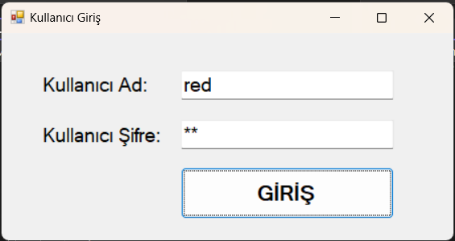
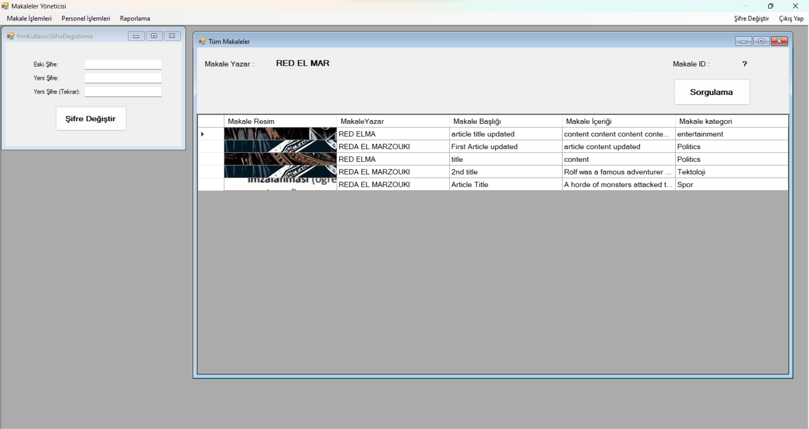
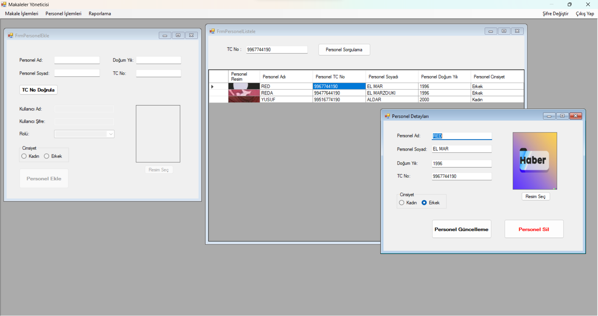
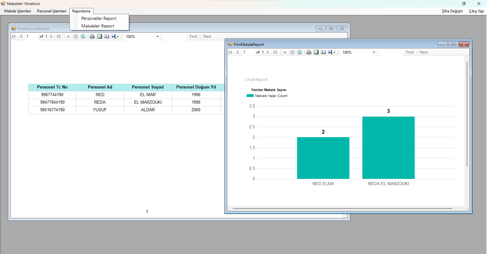

# Articles Management Automation

Articles Management Automation is a Windows Form C# project that allows users to manage articles and personnel in a SQL Server database. It has a login form that authenticates users based on their roles. Managers can add and remove personnel and list all the articles, while journalists can only add or remove articles.

## Screenshot





## Installation

To install and run this project, you need to have Visual Studio and SQL Server installed on your machine. You also need to clone this repository and open it in Visual Studio.

- Clone this repository:

```bash
git clone https://github.com/Raderne/articles-management-automation.git
```

- Open the solution file `ArticlesManagementAutomation.sln` in Visual Studio.
- In the Solution Explorer, right-click on the project `ArticlesManagementAutomation` and select `Manage NuGet Packages`.
- Install the following packages: `System.Data.SqlClient`, `System.Configuration.ConfigurationManager`, and `Dapper`.
- In the `App.config` file, change the connection string to match your SQL Server instance and database name.
- In SQL Server, create a database with the name you specified in the connection string and run the script `Database.sql` to create the tables and insert some sample data.
- Build and run the project.

## Usage

To use this project, you need to log in with a valid username and password. The sample data contains two users: a manager with username `admin` and password `1234`, and a journalist with username `user` and password `1234`. You can change or add more users in the `Personel` table.

- After logging in, you will see the main form with two tabs: `Articles` and `Personel`.
- In the `Articles` tab, you can view, add, edit, or delete articles. You can also search for articles by title, author, or date.
- In the `Personel` tab, you can view, add, edit, or delete personnel. You can also search for personnel by name, surname, or role. This tab is only available for managers.
- To log out, click on the `Log Out` button on the top right corner of the main form.

## Contribution

If you want to contribute to this project, you can fork this repository and make a pull request with your changes. You can also report any issues or suggestions on the `Issues` page of this repository. Thank you for your interest and support.
